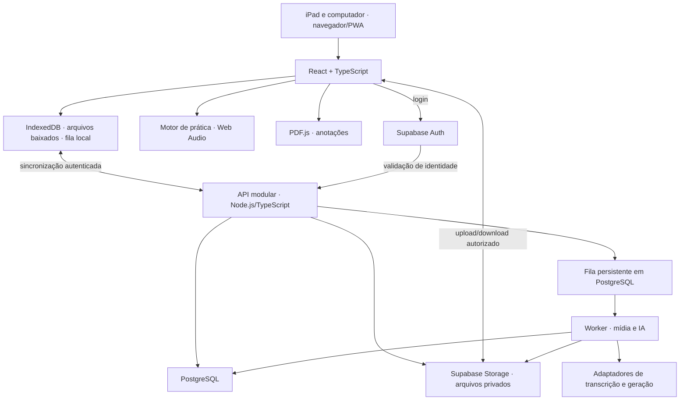

# Aplicação de estudos de piano

Proposta de arquitetura — 26/09/2026. Uma primeira versão funcional já foi implementada. Este documento preserva a arquitetura e a visão de evolução; consulte [o estado real da implementação](./IMPLEMENTACAO.md) para distinguir o que está disponível do que permanece planejado, e [o guia de execução](./README.md) para abrir o aplicativo.

Pesquisa complementar: [aplicativos de referência e funcionalidades recomendadas](./PESQUISA_APPS.md), com fontes oficiais de oito produtos e prioridades para evolução.

## Decisão principal

Construir uma **aplicação web instalável (PWA), com prioridade ao estudo offline**, para iPad de 12,9 polegadas e computador. A experiência central será abrir uma partitura, visualizar a orientação do professor e praticar um trecho em ciclos com metrônomo.

O loop solicitado é de **prática com metrônomo, sem reprodução da música**. Portanto, selecionar um trecho no PDF não exige reconhecimento automático de notas, MusicXML, MIDI ou sincronização com gravação.

Adotar React e TypeScript no cliente, armazenamento local em IndexedDB, Web Audio para o metrônomo, PDF.js para partituras e um backend modular com PostgreSQL e armazenamento privado de arquivos. Processamento de aulas e IA executam em tarefas assíncronas no servidor.

A prioridade é uma aplicação pessoal, com conta e sincronização entre dispositivos. Acesso direto do professor será uma evolução; inicialmente você poderá importar ou registrar as orientações que ele enviar.

## Experiência de uso

| Área       | O que você poderá fazer                                                                                  |
| ---------- | -------------------------------------------------------------------------------------------------------- |
| Hoje       | Retomar o último estudo, ver tarefas do professor e iniciar um plano de 15, 30 ou 45 minutos             |
| Repertório | Organizar peças em Quero estudar, Estudando e Estudadas; filtrar por compositor, dificuldade e etiquetas |
| Partitura  | Ler, escrever, destacar, inserir dedilhados, marcar dificuldades e abrir o modo de prática               |
| Aulas      | Guardar gravações, mensagens, anexos, notas e orientações; ouvir e consultar a transcrição               |
| Evolução   | Consultar sessões, trechos praticados, BPM confortável e revisões pendentes                              |

Cada peça reúne suas partituras, aulas relacionadas, observações e histórico. Uma peça pode ter diferentes edições ou versões de partitura. Marcar uma peça como estudada preserva tudo e permite colocá-la em revisão.

Uma caixa de entrada recebe textos copiados, imagens, PDFs e áudios enviados pelo professor. Cada item pode ser associado a uma aula, peça e trecho. A primeira versão usa importação pelo usuário; integrações automáticas com mensageiros ficam para depois.

### Fluxo diário

1. Abrir Hoje e escolher uma tarefa, por exemplo: “compassos 17–24, mão esquerda, regularidade”.
2. Visualizar a partitura já posicionada no trecho e a orientação relacionada.
3. Iniciar uma configuração salva: 60 BPM, oito compassos, cinco repetições, um compasso de preparação e pausa de dez segundos.
4. Ao terminar, registrar “difícil”, “melhorando” ou “confortável”, com uma observação opcional.
5. Salvar a sessão e sugerir a próxima revisão. Evolução de BPM só é aplicada quando habilitada pelo usuário.

Os números deste exemplo são parâmetros de produto, não uma prescrição pedagógica.

## Leitura e anotações na partitura

Importação inicial de PDF e imagens. Preservar o arquivo original e salvar anotações em uma camada independente, com caneta, marca-texto, texto, símbolos de dedilhado, borracha, desfazer e refazer. Permitir mostrar e ocultar camadas e exportar uma cópia com as marcações.

As anotações usam coordenadas da página original, normalizadas e independentes do zoom. Cada uma referencia uma versão imutável do documento. Rotação, escala e recorte de visualização são transformações reversíveis; trocar o PDF cria uma nova versão, sem tentar encaixar automaticamente marcações antigas.

Um trecho contém nome, páginas e regiões selecionadas, número de compassos informado pelo usuário, mão a praticar, tipo de dificuldade, prioridade e orientação. Permitir várias regiões, inclusive entre páginas. A numeração dos compassos é uma informação manual no PDF e pode ser corrigida.

Etiquetas sugeridas: ritmo, leitura, dedilhado, articulação, dinâmica, pedal e coordenação. O estado do trecho é independente do estado da peça: uma peça estudada ainda pode ter pontos de revisão.

O PDF.js será o renderizador, com páginas carregadas sob demanda e orçamento de memória para os canvases. Ferramentas de anotação serão uma camada própria. [Documentação do PDF.js](https://mozilla.github.io/pdf.js/getting_started/).

## Metrônomo e ciclos de prática

O modo de prática mantém o trecho visível, apresenta BPM, pulsação, repetição atual, tempo restante e botões grandes de iniciar, pausar e encerrar.

Configuração proposta:

| Parâmetro  | Comportamento                                                        |
| ---------- | -------------------------------------------------------------------- |
| Andamento  | BPM com unidade explícita, por exemplo semínima ou semínima pontuada |
| Métrica    | Fórmula de compasso, agrupamento, acento e subdivisões               |
| Duração    | Quantidade de compassos ou período em minutos/segundos               |
| Repetições | Quantidade definida ou repetição contínua até encerrar               |
| Preparação | Contagem inicial opcional, configurável antes de cada repetição      |
| Intervalo  | Pausa entre repetições, sem contar como prática ativa                |
| Progressão | Aumento opcional de BPM a cada N repetições, limitado ao alvo        |
| Registro   | Tempo efetivamente praticado, parâmetros usados e autoavaliação      |

Os modos de duração são mutuamente exclusivos. No modo por tempo, a duração é exata e pode terminar no meio de um compasso; a interface informa isso. No modo por compassos, o fim respeita a estrutura musical. Na primeira versão, uma configuração tem métrica fixa; para mudanças de fórmula de compasso, criar trechos separados.

**Exemplo verificável:** oito compassos de 4/4 a 60 BPM, com a semínima como unidade, duram 32 segundos. Cinco repetições totalizam 160 segundos de prática. Com preparação de um compasso em todas as repetições e quatro intervalos de dez segundos, a sessão dura 220 segundos. Não há intervalo após a última repetição.

Em 6/8, duas semínimas pontuadas por compasso diferem de seis colcheias por compasso. A configuração armazena a unidade de BPM e o agrupamento, evitando interpretar toda fórmula como quatro pulsações simples.

O motor de prática será uma máquina de estados: pronto → preparação → prática → intervalo → próxima repetição → concluído. Pausar preserva o progresso; retomar oferece nova preparação e reinicia o compasso interrompido no modo musical. Uma sessão registra separadamente o que foi concluído e o tempo parcial praticado.

Os cliques são agendados no relógio de áudio (`AudioContext.currentTime`). Um temporizador JavaScript apenas abastece a janela de agendamento; ele não determina o instante de cada clique. A interface desenha o progresso a partir do mesmo relógio. Pausar cancela eventos futuros; mudanças de BPM são aplicadas na próxima repetição. [Especificação Web Audio](https://www.w3.org/TR/webaudio/).

A aplicação **não detectará automaticamente se você tocou corretamente ou acompanhou o clique**. A conclusão do ciclo mede tempo de prática; a avaliação musical será sua e do professor.

## Aulas e IA

Permitir importar gravações e gravar pelo microfone enquanto a aplicação estiver ativa. Oferecer player com controle de velocidade, marcadores e notas vinculadas ao instante do áudio. O formato de captura deve ser selecionado conforme o suporte do navegador, com normalização no servidor.

Gravações longas terão salvamento local incremental e upload retomável. O produto mostra o estado da captura e qualquer interrupção. A gravação começa por uma ação explícita, com indicação para combinar a gravação com os participantes. Importar um arquivo continua disponível caso o navegador interrompa a captura.

Processamento proposto:

1. Upload confirmado e criação de uma tarefa persistente.
2. Validação do arquivo, normalização e divisão quando necessária para os limites do provedor.
3. Transcrição com segmentos temporais; identificação de falantes opcional e corrigível.
4. Geração de resumo, orientações, exercícios e dúvidas para a próxima aula.
5. Revisão pelo usuário e associação das orientações às peças e trechos.

A API de transcrição oferece opções de segmentos e identificação de falantes, conforme o modelo e o formato escolhido. O adaptador deve explicitar essas capacidades e preservar os deslocamentos temporais ao dividir áudios. [OpenAI Docs: transcrição](https://developers.openai.com/api/docs/guides/speech-to-text).

Exemplo de anotação proposta pela IA: “Praticar a mão esquerda lentamente nos compassos mencionados”, com um botão para ouvir a fala de origem. Se o professor não identificar claramente a peça ou o compasso, a proposta fica sem esse vínculo até você completá-lo.

Cada proposta guarda origem, segmentos de evidência, estado de revisão, versão do modelo e versão da instrução. Separar transcrição literal, resumo e sugestão gerada. Fala ambígua, música e silêncio não devem virar orientações inventadas. “Falante 1” não será automaticamente identificado como professor.

Usar saídas estruturadas para os campos de resumo e tarefas, com validação no servidor e tratamento de resposta incompleta. Formato válido não garante que a interpretação esteja correta. [OpenAI Docs: saídas estruturadas](https://developers.openai.com/api/docs/guides/structured-outputs).

Uma consulta como “O que o professor comentou sobre pedal nesta peça?” busca apenas aulas e notas autorizadas, responde com links para as evidências e informa quando não há base suficiente. A IA sugere tarefas para revisão; não altera o plano automaticamente.

Transcrição e IA dependem de conexão. Leitura, notas, metrônomo e ciclos continuam disponíveis offline. A primeira entrega de IA processa a aula depois da gravação; acompanhamento ao vivo é uma evolução separada.

## Arquitetura técnica



| Camada             | Escolha proposta                                | Motivo                                                            |
| ------------------ | ----------------------------------------------- | ----------------------------------------------------------------- |
| Interface          | React + TypeScript + Vite                       | Aplicação interativa, com regras e componentes compartilhados     |
| Instalação/offline | Manifesto PWA e service worker                  | Abrir como aplicativo e carregar os recursos previamente baixados |
| Dados locais       | IndexedDB com Dexie                             | Transações locais, anotações e operações pendentes                |
| Partituras         | PDF.js + camada vetorial própria                | Separar documento original das marcações editáveis                |
| Áudio              | Web Audio API                                   | Agendamento dos cliques independente da renderização da interface |
| API                | Node.js + TypeScript + Fastify, REST/OpenAPI    | Contratos explícitos e módulos por capacidade do produto          |
| Dados remotos      | PostgreSQL gerenciado no Supabase               | Relações, transações, histórico e políticas de acesso             |
| Login/arquivos     | Supabase Auth e Storage privado                 | Reduzir o trabalho inicial de infraestrutura                      |
| Tarefas demoradas  | Worker Node.js e fila persistente em PostgreSQL | Retentativas, controle de custos e isolamento de processamento    |
| IA                 | Adaptadores para transcrição e geração          | Trocar modelo/provedor sem alterar o domínio                      |
| Verificação        | Vitest, Playwright e testes no iPad físico      | Cobrir lógica, fluxos e limitações reais do dispositivo           |

Essas são escolhas propostas, não dependências já instaladas. Versões e licenças serão verificadas e fixadas na implementação.

O backend será um **monólito modular**: uma aplicação organizada por repertório, documentos, prática, aulas, IA e sincronização. API e worker têm processos distintos, mas compartilham contratos e regras. Isso permite crescer sem introduzir a operação de vários microsserviços no início.

Hospedagem prevista: frontend estático com HTTPS/CDN, API e worker em contêineres e serviços gerenciados de dados. O worker pode usar ferramentas de mídia isoladas, com limites de memória, duração e execução. Provedor de hospedagem e orçamento são decisões de implantação, sem contratação nesta etapa.

Estrutura sugerida para a implementação:

```text
apps/web                  interface e PWA
apps/api                  autenticação, contratos e sincronização
apps/worker               processamento de aulas e arquivos
packages/domain           entidades e regras de estudo
packages/practice-engine  estados, compassos, ciclos e BPM
packages/score-viewer     documentos, coordenadas e anotações
packages/contracts        schemas e contratos da API
packages/adapters         persistência, áudio e provedores de IA
```

## Modelo de dados

| Entidade          | Responsabilidade e relações                                          |
| ----------------- | -------------------------------------------------------------------- |
| Piece             | Obra, compositor, etiquetas e estado no repertório                   |
| ScoreVersion      | Edição/versão imutável da partitura; pertence a uma peça             |
| Asset             | Arquivo privado, checksum, tipo, tamanho e estado de upload          |
| Annotation        | Marca ou texto vinculado à versão e à página                         |
| PracticeSegment   | Trecho com uma ou várias regiões da partitura e dificuldade          |
| PracticePreset    | BPM, unidade, métrica, duração, repetições e pausas                  |
| PracticeSession   | Execução de uma configuração, com parâmetros congelados e resultados |
| Lesson            | Aula, data, professor e peças relacionadas                           |
| LessonRecording   | Gravação da aula e seu arquivo                                       |
| TranscriptSegment | Texto, posição temporal e falante de uma gravação                    |
| Note              | Observação manual ou importada; origem e vínculos opcionais          |
| StudyTask         | Ação a praticar, prioridade, prazo e vínculo com aula/trecho         |
| AIProposal        | Sugestão revisável e referências para suas evidências                |
| SyncOperation     | Operação idempotente enviada por um dispositivo                      |

Registros pertencem a um usuário e usam identificadores geráveis offline, datas UTC, versão para concorrência e marca de exclusão quando necessário. Uma sessão mantém uma cópia de seus parâmetros: mudar o preset depois não altera o histórico.

Contratos iniciais: `/v1/sync/push`, `/v1/sync/pull?cursor=...`, `/v1/assets/uploads`, `/v1/lessons/{id}/processing` e `/v1/jobs/{id}`. Operações de domínio seguem os mesmos módulos. Upload só passa a estar disponível para processamento após finalização e verificação do arquivo.

## Offline, sincronização e proteção dos dados

Salvar a edição e a operação pendente na mesma transação local. Sincronizar ao abrir o aplicativo, recuperar conexão e periodicamente enquanto estiver ativo; não depender de execução em segundo plano. O servidor aplica operações idempotentes, controla versões e devolve alterações por cursor persistente.

Anotações independentes podem ser mescladas por identificador. Edições concorrentes no mesmo texto preservam as duas versões para escolha; não substituir silenciosamente uma pela outra. Exclusões usam marcadores até os dispositivos convergirem, com procedimento de ressincronização para dispositivos muito antigos. O relógio do dispositivo não decide sozinho qual conteúdo vence.

Mostrar “salvo neste dispositivo”, “sincronizado” e “conflito a revisar”. Um download só recebe o selo “disponível offline” depois de íntegro. Oferecer seleção por peça/aula, indicação de espaço, remoção de downloads e exportação de dados. Nunca remover um arquivo com alterações locais ainda não enviadas como parte de limpeza automática.

O armazenamento do navegador está sujeito a limites e possível remoção. Solicitar persistência quando suportada, acompanhar quota e manter cópia remota dos arquivos sincronizados. Nenhuma dessas medidas torna alterações ainda não sincronizadas imunes à limpeza do navegador. [Política de armazenamento do WebKit](https://webkit.org/blog/14403/updates-to-storage-policy/).

Arquivos ficam em buckets privados, com permissões por proprietário e URLs temporárias. A API valida identidade e propriedade, inclusive ao criar jobs e consultar resultados; políticas de banco e Storage reforçam o isolamento. Chaves privilegiadas e de IA permanecem no servidor. [Controle de acesso do Supabase Storage](https://supabase.com/docs/guides/storage/security/access-control).

Exportar originais, partituras anotadas e dados estruturados. Backups devem cobrir banco e objetos separadamente, com teste de restauração. Exclusões de aulas devem alcançar áudio, transcrições e resultados derivados, segundo uma política explícita de retenção. Logs não devem conter o conteúdo integral das aulas.

## Uso no iPad de 12,9 polegadas

Em retrato, priorizar uma página grande com controles inferiores recolhíveis. Em paisagem, permitir partitura ao centro e painel lateral de orientações; oferecer duas páginas quando a legibilidade permitir. Modo foco esconde a navegação e mantém apenas os controles essenciais.

Layout responde ao espaço disponível, incluindo multitarefa e teclado virtual, sem assumir resolução fixa. Botões terão área de toque confortável, contraste adequado, rótulos acessíveis e ações equivalentes por teclado no computador.

Anotação por mouse, toque e Apple Pencil usa Pointer Events, diferenciando caneta de toque quando o navegador fornecer essa informação. Oferecer modo “caneta desenha; dedo navega” e modo de desenho por toque. Pressão e rejeição de palma precisam ser verificadas no iPad físico; não assumir paridade com uma aplicação nativa. [Pointer Events](https://developer.mozilla.org/en-US/docs/Web/API/Pointer_events).

Solicitar que a tela permaneça acesa durante a prática quando a API estiver disponível. O bloqueio pode ser liberado pelo sistema e precisa de recuperação ao voltar à página. [Screen Wake Lock](https://developer.mozilla.org/en-US/docs/Web/API/Screen_Wake_Lock_API).

**Contrato da primeira versão:** prática e captura de aula com a aplicação em primeiro plano e tela ativa. Ao detectar suspensão/interrupção, parar o ciclo, registrar o estado e retomar com preparação; não tentar tocar cliques atrasados. Não prometer metrônomo ou gravação contínuos com tela bloqueada.

Safari no iPad e navegadores de computador serão alvos explícitos de teste. Emulação de viewport no computador não valida áudio, microfone e Pencil. A geração do iPad e a versão de iPadOS deverão ser registradas na validação, porque 12,9 polegadas não identifica o hardware nem o sistema.

## Entregas e critérios de aceite

| Etapa                        | Entrega                                                                         | Condição para avançar                                                           |
| ---------------------------- | ------------------------------------------------------------------------------- | ------------------------------------------------------------------------------- |
| 0 — Validação no dispositivo | Prova de leitura, caneta, áudio, persistência e captura                         | Executar no iPad real e definir a matriz de suporte                             |
| 1 — Acervo                   | Login, repertório, PDFs, anotações, trechos, notas do professor e sincronização | Anotar offline e reencontrar as marcações no computador sem perder dados        |
| 2 — Prática                  | Metrônomo, ciclos, preparação, pausas, presets e histórico                      | Conferir contagem/duração e interrupção segura durante navegação e renderização |
| 3 — Aulas                    | Gravação/importação, player, transcrição, propostas da IA e tarefas             | Abrir a evidência de cada orientação e recuperar falhas sem duplicar resultados |
| 4 — Aprimoramento            | Revisões, planos de estudo, exportação completa e refinamentos                  | Verificar o fluxo diário completo e a restauração de dados                      |

As etapas 1 a 3 compõem a primeira versão funcional do escopo solicitado. Exportação básica e recuperação de gravação acompanham suas respectivas funcionalidades; a etapa 4 amplia essas capacidades.

Verificações indispensáveis na implementação: cálculo de compassos simples e compostos; pausa e retomada; ausência de cliques duplicados; teste de áudio prolongado no iPad; troca de orientação e zoom sem deslocar anotações; arquivo grande sem esgotar memória; sincronização duplicada e fora de ordem; conflito entre dois dispositivos; quota esgotada; upload interrompido; isolamento entre contas; aula com silêncio e piano sem falsa fala; reprocessamento que preserve notas revisadas.

Metas a medir na prova técnica: resposta imediata da anotação, abertura rápida de documentos já baixados e metrônomo sem deriva acumulada perceptível em uma sessão de 30 minutos. Os limites numéricos de desempenho serão definidos após medição no aparelho alvo. Nenhum desses testes foi executado nesta etapa de arquitetura.

## Evolução prevista

Priorizar revisões espaçadas de peças estudadas, plano semanal baseado em tarefas do professor, comparação de gravações próprias e acompanhamento de BPM confortável por trecho. Tempo acumulado não será apresentado como medida suficiente de domínio musical.

Depois, avaliar acesso do professor com compartilhamento explícito, pedal para virar páginas, MusicXML e MIDI, reprodução de partituras digitais e análise de execução. Um renderizador MusicXML pode usar OpenSheetMusicDisplay, mantendo o motor de reprodução separado. [Documentação do OpenSheetMusicDisplay](https://opensheetmusicdisplay.github.io/classdoc/).

Reconhecimento de partitura fotografada e avaliação automática de execução exigem experimentos próprios e correção humana; não bloqueiam o estudo com PDF.

Se uso com tela bloqueada ou recursos avançados de Apple Pencil se tornarem requisitos, adicionar uma distribuição nativa com Capacitor e adaptadores específicos, validando áudio, armazenamento e desenho no iOS. Essa alternativa reaproveita partes da aplicação web, mas exige trabalho nativo e distribuição própria. [Capacitor](https://capacitorjs.com/docs).

## Custos e decisões futuras

A pesquisa de produtos reforça o uso de cartões de estudo por trecho, marcação rápida de dificuldades, modo foco e camadas nomeadas no fluxo principal. Rotinas reutilizáveis, gravações vinculadas aos exercícios, evolução por mão/BPM e preparação da próxima aula são melhorias propostas para depois da base estável. As prioridades e extensões de dados estão detalhadas em [PESQUISA_APPS.md](./PESQUISA_APPS.md); não representam funcionalidades implementadas nem obrigação de incluir todas na primeira versão.

Custos recorrentes dependerão de hospedagem, armazenamento, tráfego e minutos de aula processados, além dos tokens usados em resumos e consultas. Medir consumo por aula, reutilizar transcrição já pronta, limitar concorrência e permitir orçamento mensal de IA. Retentativas usam identificadores de tarefa e checkpoints; em resposta incerta de um provedor, pode haver custo repetido e isso deve ser contabilizado.

Não há estimativa monetária fechada sem volume de aulas, tamanho do acervo e plano de hospedagem. Antes de implementar a captura e validar o offline, confirmar a geração do iPad, versão de iPadOS, duração típica das aulas e volume aproximado de partituras. Essas informações calibram a implementação; não impedem a arquitetura definida aqui.
